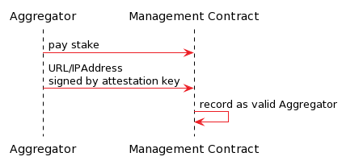

## L2 Nodes
There are two categories of nodes in the Obscuro network:

### Aggregator Nodes
Aggregators are the Obscuro nodes whose TEEs are in possession of the _shared secret_ and can submit rollups to the L1. To gain this privilege, these nodes must pledge a stake.

End users will send encrypted transactions to any registered Aggregators who will then gossip the transactions. Every round, one of the Aggregators will publish the transaction in a rollup.

Aggregators have the following functions:
* Integrate with an L1 node to monitor published blocks and to submit rollups.
* Gossip with the other Aggregators registered in the Management Contract.
* Interact with the TEE:
    - Submit user encrypted transactions.
    - Submit signed user balance requests and encrypted responses back to the users.
    - Submit proofs of block inclusion and receive signed rollups.
* Store data encrypted by the TEE and make it available when the TEE requests it. Act as an encrypted database.

These are the steps to become an Aggregator.
* Register with the L1 Network Management Contract and pay a significant stake in the Obscuro token. The stake has multiple roles. The first one is to penalise Aggregators who attempt to hack the protocol, and second is for the Aggregators to buy into the ecosystem, so that they will make an effort to keep it running smoothly.
* Set up a server with a valid, unaltered, up-to-date and secured TEE and provide an attestation from the hardware manufacturer or a delegate to the Management Contract.
* On seeing this request to join the network published to the L1, another registered TEE will share the shared secret, used to encrypt and decrypt user transactions.
* Once in possession of the secret, the TEE can start processing all the L2 transactions that are stored on the L1 blockchain and build the state.
* Once this is completed, the new Aggregator can join the gossip with the other Aggregators and participate in the lottery for producing rollups.
* Some end users will send encrypted instructions directly to this server, and it will gossip these with other nodes in the L2 network, encrypted with the shared secret.
* As Aggregators process messages, they maintain the L2 state in the encrypted TEE memory or encrypted in a local database. If they are the winner of the lottery, when the time comes they will create a valid rollup and publish it to L1.
* All Aggregators keep track of the blocks submitted to the Management Contract to make sure they are up-to-date with the source of truth.
* The first Aggregator to register has a special role, as it has to create the _Master Seed_.

Note: Each Aggregator needs an ETH balance on the L1 to pay for the submission of the rollup.

The sequence for node registration is shown in the following diagram:

### Verifier Nodes
Verifiers are nodes in possession of the shared secret that have not pledged the stake and are not part of the Aggregator gossip network. To receive the L2 transactions, they monitor the L1 network and calculate the state based on the rollups submitted there.

End users can interact with either Aggregators or Verifiers to receive events on submitted transactions or query their accounts' balance. Any end-user can become a Verifier with minimal cost if they have compatible hardware.

Allowing these two categories lowers the bar for participation, thus making the network more robust and decentralised since more independent parties guard the shared secret. In a typical system, the more parties are given access to a secret, the more vulnerable it becomes. In the case of Obscuro, the secret is only available inside the TEE, and as long as that is secure, it cannot be obtained by anyone.
