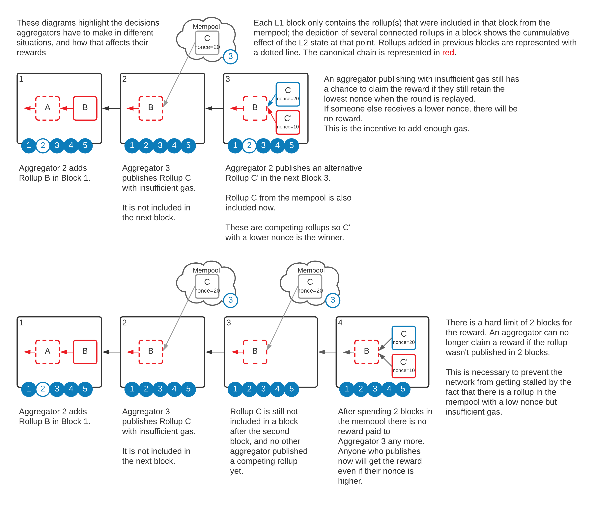
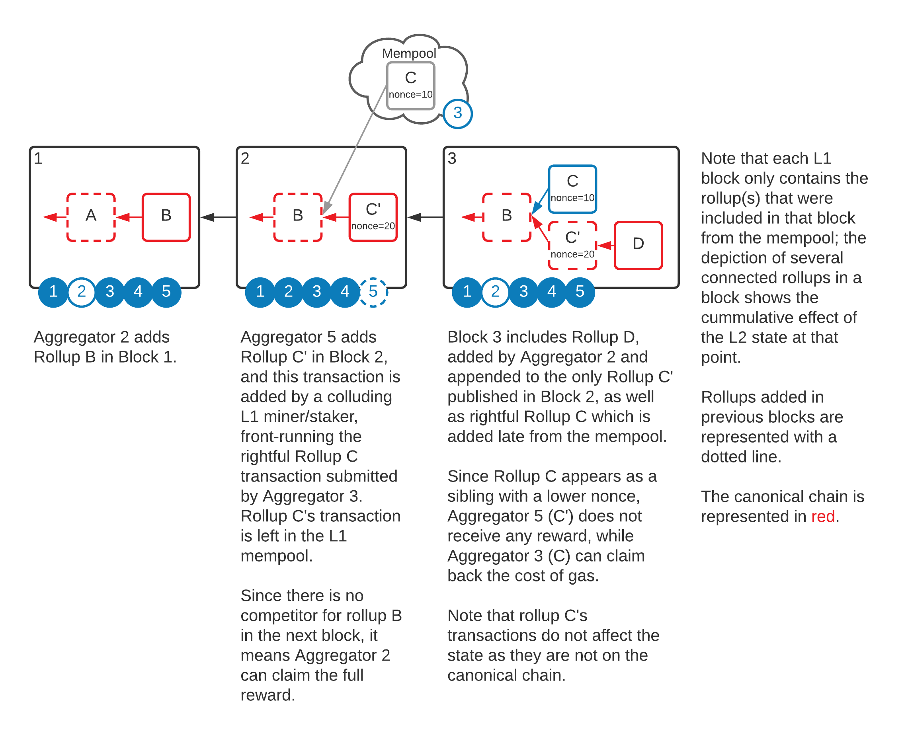

## Proof of Block Inclusion
Obscuro uses a novel decentralised round-based consensus protocol based on a fair lottery and on synchronisation with the L1 designed for L2 rollups, called _Proof Of Block Inclusion_ (POBI). Fair leader election is a fundamental issue that all decentralised rollup solutions have to address.
POBI is inspired by [Proof Of Elapsed Time](https://sawtooth.hyperledger.org/docs/core/releases/1.0/architecture/poet.html).

### High Level Description
The high level goals of the POBI protocol are:
1. Each round, to distribute the sequencer function fairly among all the active registered aggregators.
2. To synchronise the L2 round duration to L1 rounds. Because the L1 is the source of truth, the finality of the L2 transactions is dependent on the finality of the L1 rollup transaction that includes them, which means there is no advantage in publishing multiple rollups in a single L1 block. It is not possible to decrease the finality time below that of the L1. On the other hand, publishing L2 rollups less frequently means that L2 finality will be unnecessarily long. The optimum frequency is to publish one rollup per L1 block.

To achieve fairness, the PoBI protocol states that each round the TEE can generate one random nonce and the winner of a round is the aggregator whose TEE generated the lowest random number from the group. The TEEs will generate these numbers independently and then will gossip them. The aggregators who didn't win the round, similar to L1 miners, will respect this decision because it is the rational thing to do. If they don't want to respect the protocol, they are free to submit a losing rollup to the L1, but it will be ignored by all compliant aggregators, which means such an aggregator has to pay L1 gas and not get any useful reward.

We achieve the second goal by linking the random nonce generation which terminates a round to the Merkle proof of inclusion of the parent rollup in a L1 block. This property is what gives the name of the protocol. This means that an aggregator is able to obtain a signed rollup from the TEE only if it is able to present a Merkle proof of block inclusion to the TEE. This feature links the L1 block creation to the L2 rollup creation, thus synchronising their cadence.

A party wishing to increase its chances of winning rounds will have to register multiple aggregators and pay the stake for each. The value of the stake needs to be calculated in such a way as to achieve a right decentralisation and practicality balance.

It is very easy for all the other aggregators to verify which rollup is the winner, by just comparing the nonces.

Note that the L1 management contract is not checking the nonces of the submitted rollups, but it checks that the block inclusion proof is valid.

A further issue is to ensure that the host will not be able to repeatedly submit the proof to the TEE to get a new random number.

### Typical Scenario
1. A new round starts from the point of view of an aggregator when it decides that someone has gossiped a winning rollup. At that point it creates a new empty rollup structure, points it to the previous one, and starts adding transactions to it (which are being received from users or by gossip).
2. In the meantime it is closely monitoring the L1 by being directly connected to a L1 node.
3. As soon as the previous rollup was added to a mined L1 block, the aggregator takes that Merkle proof, feeds it to the TEE who replies with a signed rollup containing a random nonce generated inside the enclave.
4. All the other aggregators will be doing roughly the same thing at the same time.
5. At this point (which happens immediately after the successful publishing of the previous rollup in the L1), every aggregator will have a signed rollup with a random nonce which they will gossip. The party with the lowest nonce wins. All the aggregators know this, and a new round starts.
6. The winning aggregator has to create an ethereum transaction that publishes this rollup to L1.

Note that by introducing the requirement for proof of inclusion in the L1, the cadence of publishing the rollups to the block times is synchronised.
Also, note that the hash of L1 block used to prove to the TEE that the previous rollup was published will be added to the current rollup. The management contract, and the other aggregators will only accept proofs from the _final_ fork. ([TODO- more details])

This sequence is depicted in the following diagram:

### Preventing Repeated Random Number Generation
In Phase 3 of the protocol, the TEE of each aggregator generates a random number which determines the winner of the protocol. This introduces the possibility of gaming the system by restarting the TEE, and attempting to generate multiple numbers.

The solution proposed by Obscuro is to introduce a timer upon startup of the Enclave, in the constructor. A conventional timer, based on the clock of the computer is not very effective since it can be gamed by the host.

The solution is for the enclave to serially calculate a large enough number of SHA256 hashes that it couldn't do it faster than 10 seconds on even a very fast CPU.

This solution is effective, since the code is attested, and does not rely on any input from the host.

This built-in delay is also useful in preventing other side channel attacks.

## Failure Scenarios and Incentives
The next sections will analyze different failure scenarios and how the incentives ensure good functioning.

### Non-publishing Sequencer Scenario
Compared to a typical L1 protocol, there is an additional complexity. In a L1 like Bitcoin or Ethereum, once a node gossips a valid block, all the other nodes are incentivised to use it as a parent, because they know everyone will do that as well. In a L2 decentralised protocol like POBI, there is an additional step, which is the publication of the rollup to L1, which can fail for multiple reasons.

#### Incentives For Publishing
The high level goal is to keep the system functioning as smoothly as possible, and be resistant to random failures or malicious behaviour, while not penalising Obscuro nodes for not being available.

The reward mechanism implements the following rules:
1. Pay an attractive reward to the winner of the round if they publish the rollup such that it is included in the next Ethereum block.
2. Pay a minimal reward if it is included with one block delay. This reward should only cover the cost of the gas.
3. Do not pay anything to a competing aggregator that front-runs the winner, and publishes an alternative non-winning rollup. Considering that the frontrunner is consuming precious Ethereum gas, this mechanism is in effect a punishment.
   This case will manifest itself as two competing rollups for the same generation published in sequential Ethereum blocks, where the rollup published in the first block has a higher nonce.

_Note that in the latter case, to achieve smooth running, the non-winning rollup published by the frontrunner is part of the canonical chain, but it pays no reward._

As a consequence of these rules, any winning aggregator is incentivised to publish with the _gas_price_ high enough to claim the full reward.

The reward rules are depicted in the following diagram:

If there is a random spike or delay and the rollup is added to the next block, they at least don't make a loss.
In such a scenario, the rest of the aggregators have two options:
- Either replay the round, and thus compete with the rollup already in the mempool.
- Start a new round on top of the previous one.

It makes more sense to go for the second option if the rollup has a good chance of being added to the next block, since the odds of receiving a lower nonce than the previous winner is quite low.

In the case of a front-running attack, rational miners will receive the gas cost back, but not make any profit, while the frontrunners will not get any reward, thus lowering the overall running cost of the network.

The rules in the case of front-running are depicted in the following diagram:

### Competing L1 Blockchain Forks
In theory, different L2 aggregators could be connected to L1 nodes that have different views of the L1 ledger. This will be visible in the L2 network as rollups being gossiped that point to different L1 forked blocks. Each aggregator will have to make a bet and continue working on the L1 fork which it considers to have the best chance. This is the same behaviour as any L1 node.

This is depicted in [Basic Rollup Data Structure](rollup-data-structure.md).

In case it proves that the decision was wrong it has to roll back the state to a checkpoint and replay the winning rollups.