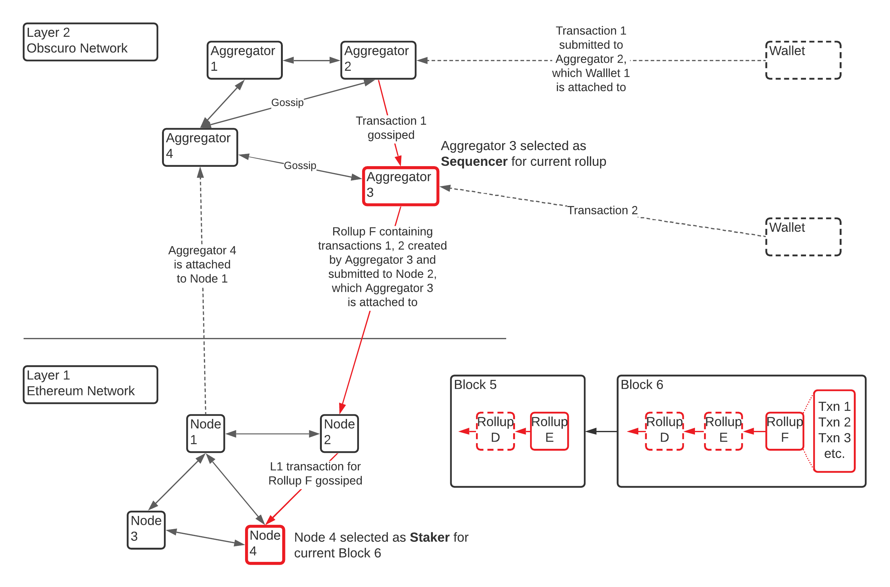

# High Level Design
Obscuro has designed for an L2 protocol, where user activity is moved _off-chain_ from the L1, and it follows the increasingly common rollup pattern to store transactions on the L1 chain to achieve data availability. Most [rollup](https://vitalik.ca/general/2021/01/05/rollup.html) implementations exist to provide scalability for L1 networks, but the prime objective of Obscuro is to provide confidentiality.

L2 networks have a unidirectional dependency on an L1 network: while the L2 network relies on the L1 network to provide an immutable and public record of transaction data and to provide censorship resistance, liveness and availability, the L1 network is unaware of any individual L2 network. L2 submitted rollups are just normal L1 transactions.

The following diagram shows the interactions between the two decentralised networks, Ethereum (L1) and Obscuro (L2): Obscuro is formed of Nodes called Aggregators, who compete to process user transactions, roll them up, and submit for inclusion in Ethereum blocks. Ethereum, through its protocol, leverages its own nodes to produce Ethereum blocks containing, amongst other things, the submitted Obscuro rollups.

On the bottom right, this diagram also depicts the state of a simple rollup chain as it is found in the sequential L1 blocks. 

## L1 Network
On the L1 network there are several regular Ethereum contracts, referred to as Management Contracts.

Note: the L1 design is covered in more detail in [L1 Contracts](./l1-contracts.md).

### Network Management
This contract is the gatekeeper for the protocol. Any Obscuro node wishing to join the network will have to interact with this contract and prove it is valid. 
This contract will also manage the TEE attestation requirements and will be able to verify attestation reports.

It will also manage the stake of the participants able to submit rollups known as Aggregators.

_Note: The stake is a piece of the game-theory puzzle that ensures that Obscuro participants have the right incentives to follow the protocol._

### Rollup Management
This module accepts rollups submitted by L2 nodes and includes them in the rollup-chain structure. It works together with the bridge in processing withdrawal requests from users.

### Obscuro Bridge
This contract is very important for the solution's security since it will protect all liquidity deposited by Ethereum end-users, and reflected in the confidential Obscuro ledger.

## L2 Network
The goal of the L2 design is to create a fair, permissionless, and decentralised network of nodes with valid TEEs who cannot see the transactions they are processing while collaborating to manage a ledger stored as rollups in the L1. The ledger should preserve its integrity even in the face of catastrophic TEE hacks.

All Obscuro nodes have to go through the attestation process with the Network Management contract before receiving the shared secret and participating.

Note: the shared secret is covered in the [cryptography section](cryptography.md)



