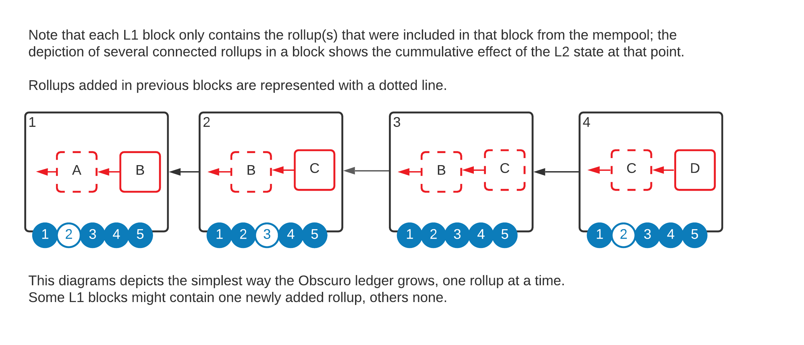
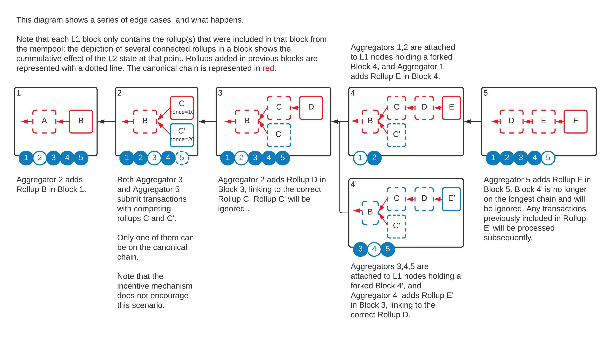

## Rollup Data Structure
The management contract implements a blockchain-like data structure to hold the rollups. Each rollup points to a parent rollup, and at any time there can be multiple competing sibling rollups. Similar to L1 blockchains, it is the responsibility of the individual L2 nodes to decide which sibling is valid. The difference is that un-hacked nodes are not able to build upon an invalid rollup.

The diagram below depicts an L1 blockchain (in black). Each block contains a snapshot of the state of the Obscuro rollup chain (in Red). There are 5 Obscuro nodes, each of them connected to different L1 nodes.

Note that forks are possible at both layers, and it is the responsibility of the Obscuro nodes to navigate and choose the most likely L1 block and L2 rollup. The following diagram shows two more complex scenarios, where firstly an extra aggregator publishes an additional rollup to a block, and secondly the L1 chain forks. 

