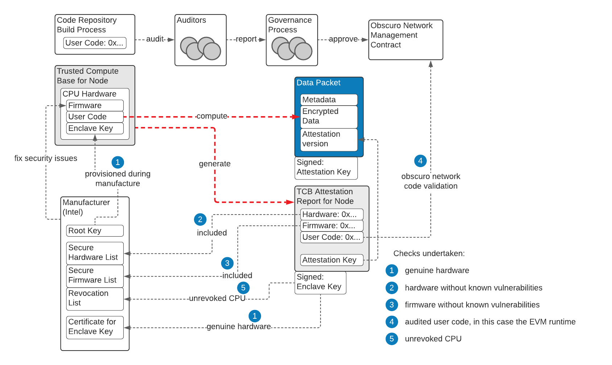

# Technical Background

This section briefly covers the key technologies on which Obscuro relies.

We recommend reading through the "Trusted Execution Environment" section because it introduces concepts and notations used throughout the paper.

## Ethereum
Ethereum is a public, transparent, permissionless blockchain system and network of nodes, supporting account-based smart contracts, where business logic can be deployed as code to create an immutable and uncensorable contract which can hold and control the flow of value. The Ethereum mainnet went live in 2015 and is the most mature and adopted smart contract system. Read more on the official [website](https://ethereum.org/en/).

## Trusted Execution Environment
A TEE is a secure area of a central processor or CPU. It guarantees code and data loaded inside to be protected with respect to confidentiality and integrity as it is processed. Obscuro focuses initially on Intel's SGX, based on the team's 5 years of experience developing a confidential computing product with it. The TEE data cannot be read or processed outside the enclave, including processes running at higher privilege levels in the same host.

An SGX-capable CPU has two device root keys that are fused into it by the manufacturer, the _Root Provisioning Key_ (RPK) and the _Root Sealing Key_ (RSK). The RPK is known to Intel and used to prove a CPU is genuine via remote attestation and the RSK is not known to any entity outside the CPU. These keys can be used to create other CPU specific keys. In this whitepaper, we will refer to them as the _Enclave Key_ (EK).  Processes and users outside the enclave encrypt data that is only meant for the enclave using keys generated inside the enclave. When the enclave wishes to store data, it is again encrypted so that the host (the server which stores the data) is not able to see it.

Attestation allows user verification that the enclave is running on a genuine SGX capable CPU that is properly-patched, and the application running inside the enclave matches a particular codebase and is un-tampered before the user shares confidential data with it. This allows the user or someone trusted by them to audit the code of the application in advance and know for sure that only that code will see that data.

In Obscuro's case, the SGX application is a virtual machine largely compatible with the EVM, allowing execution of existing Ethereum smart contracts, along with the rollup functionality necessary to interact with the L1 contract.

The _Trusted Computing Base_ (TCB) is defined as the set of computing technologies that must be working correctly and not be malicious or compromised for a security system to operate. The TCB is composed of the hardware TCB (the CPU) and the software TCB (the CPU microcode and the application).
Attestation provides to the Verifier a report containing the details about all the components of a TCB, like CPU type, the SGX security version number (CPUSVN) and the version of the application.

An attestation report that was deemed as secure could become insecure if a vulnerability is disclosed. At that moment, the system needs to be re-secured, a process which is called TCB recovery.

This whitepaper refers to the _Attestation Report_ (AR) as a generic object that describes the TCB and also contains an encryption key referred to as the _Attestation Key_ (AK), and as _Attestation Constraints_ (AC) to a set of constraints that a report must satisfy to be considered secure at a point in time. The constraints will change over time as vulnerabilities are discovered, the software is upgraded with new features or to keep up with the evolution of the EVM. The Obscuro nodes will have to upgrade to continue participating in the network.

Any message originating from an enclave can be signed with the AK. This is a guarantee for the recipient that it must have originated only inside a valid enclave.

The diagram below is a conceptual high-level overview of the mechanism by which a TEE manufacturer and a group of security auditors propagate trust to the output of the computing performed inside the TEE.

A signature from the EK attests that a signed data packet originates from a genuine CPU. That is not enough for the output of typical confidential computing use cases, as clients have to know what program runs inside the CPU and what firmware.

To solve this problem, the TEE generates a new key (the AK) derived from the RSK, which is then included in the attestation report, together with the software and hardware versions, and signs this report with the EK.

By this mechanism, data packets signed with the AK include the trust from the genuine CPU and the hash of the program attested by the group of auditors.

## Rollups
The two approaches to scaling L1 blockchains are to improve the capacity of the blockchain, or move processing away from it but tie back to it.

The first approach can make the blockchain more centralised, as the cost of node infrastructure increases (limiting the number of participants able to afford it) or the number of nodes involved in consensus decreases. A variation splits the accounts into shards, allowing validation to happen in parallel, and this is the current approach on the Eth2 roadmap.

The second approach is to allow users to engage with contracts on a second-layer network of nodes, where the majority of the processing work is undertaken. One example of the second approach is _rollups_, where the L2 transactions are verified and posted in compressed form in a single rollup transaction to the L1 blockchain. There is an L1 contract which processes deposits and withdrawals. In zero-knowledge rollups, L1 nodes can undertake a lightweight process of verification of the correctness of activity on the L2 network, whereas in optimistic rollups, the L2 transactions submitted are assumed to be correct, but another L2 node may disprove them during a challenge window.
