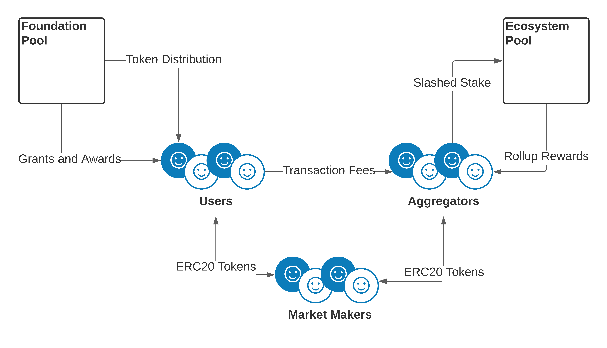

# Tokenomics
The network requires the participation of several types of actor, some of whom incur costs in performing their roles and need to be remunerated. Furthermore, the system's security depends, in part, on the ability to economically punish those who can be proved, within the protocol, to have acted maliciously. This is achieved through a traditional staking model, and a digital asset, OBX, is used for these purposes.  In what follows, we outline the functions such a token performs in the system, the game-theoretic requirements with respect to Sybil-resistance, broad allocation and stakeholder incentivisation, and how the minting and distribution of the token have been designed to achieve these ends.  Readers only interested in the technical design of the platform should skip this section for now.

The main goals for the creation of the OBX token are to provide a truly decentralised network and sustainable growth of the network. That means creating an equally attractive system to developers, Obscuro node operators, end-users, enterprises, and the wider community. The OBX Token will be issued as a utility token and not a regular coin or security [^1].  The token has four primary uses:

* To provide an inflationary _block reward_ to incentivise users to operate obscuro nodes.
* An accounting mechanism to charge users for transaction computation and state storage or gas.
* A means to fund the ongoing development of the Obscuro platform.
* A way to incentivise eco-system development via grants and competitions.

The OBX token is issued initially onto Ethereum Mainnet as an ERC-20 token. This is because it's easier to bootstrap adoption onto an already existing network with financial infrastructures such as exchanges and other existing DeFi applications. The intention is that the OBX token is not issued until the first release of the Obscuro platform is substantially complete. In other words, it should be possible to use Obscuro in a testnet environment as a pre-requisite for the utility token launch to proceed.

On Obscuro entering production, an allocation of tokens for aggregator rewards will be issued directly onto the Obscuro network. Therefore, there are two classes of token: Ethereum native and Obscuro native, and participants can move seamlessly between them using a two-way bridge.

## Utility Token Allocation
Token allocation is benchmarked to similar successful projects. Typically, such projects distribute their token into three primary segments where no single group has a majority of the allocation, and Obscuro chooses the same approach:

1. Team
    1. Initial funders.
    2. The founding team.
    3. The Obscuro Foundation.
2. Treasury and eco-system
    1. Application developers.
    2. Inflationary block rewards.
3. Community
    1. Market makers.
    2. Aggregators.
    3. Users.

One point to note on the listing above is the allocation to initial funders. They include the initial developer of Obscuro.  They receive an allocation of the Obscuro token as payment in kind for the work done to date on the project. This is a one-time only allocation, after which funders will not be involved in either development or day to day operations of the Obscuro Foundation. The number of tokens allocated to funders is to be agreed upon by the Obscuro Foundation.

## Relationship to ETH
As each Obscuro block is published to the Ethereum Mainnet, Obscuro aggregators must hold a balance of ETH to publish. Aggregators get paid in OBX (via block reward and transaction fees) and have outgoings in ETH; therefore, there exists currency exposure between OBX and ETH, which, in theory, can be hedged with futures or options if such a market existed. The combination of transaction fees and block reward in terms of ETH must be large enough to:
* Cover the ETH required to publish the latest Obscuro block to Ethereum mainnet.
* Cover the Obscuro computation required to validate and publish the block.
* Cover a profit margin for the Obscuro aggregators.

It is thus essential for the OBX/ETH price to remain as stable as possible. The incentives of the various groups involved in the network should be able to facilitate this. To participate in the network or become an aggregator, users must buy OBX tokens. On the flip side, aggregators are likely to sell OBX to cover their ETH expenses. These flows coupled with large amounts of OBX locked up in staking arrangements should enable OBX to retain enough value versus ETH to ensure being an aggregator is profitable.

Gas is accounted for in the same way Ethereum does, with a market for OBX gas based upon the supply and demand determined by Obscuro node operators/verifiers. Income of OBX _in ETH terms_ to an aggregator must be greater than the ETH they require to publish the block to Ethereum Mainnet.

## Illustrated flows

Over time the community pool decreases in size. Likewise, the eco-system pool also decreases in size. However, the amount of tokens held by the community (users, market makers, witnesses and node operators) increases in size. Likewise, the team pool decreases in size over time as tokens are sold to fund development.

[^1]: OBX is not a security because there is no expectation of profit. Indeed, OBX  is issuer-less in that no incorporated entity credits its balance sheet equity or liabilities in conjunction with the issuance of OBX. In addition, OBX is not a regular coin as it is not for use as a generic medium of exchange.
